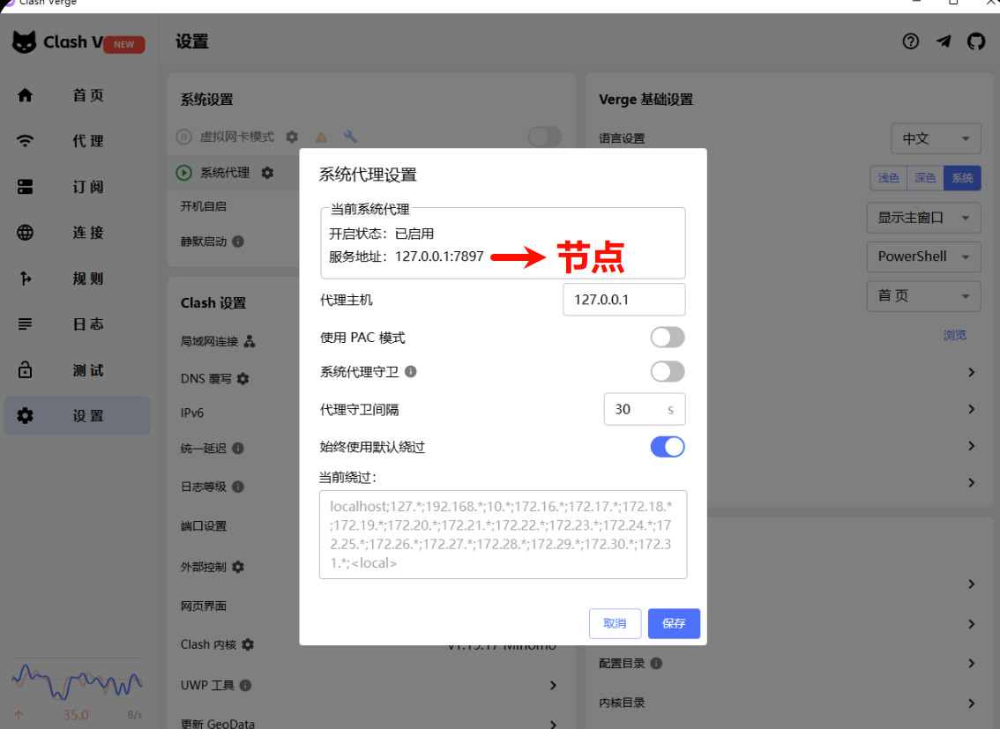
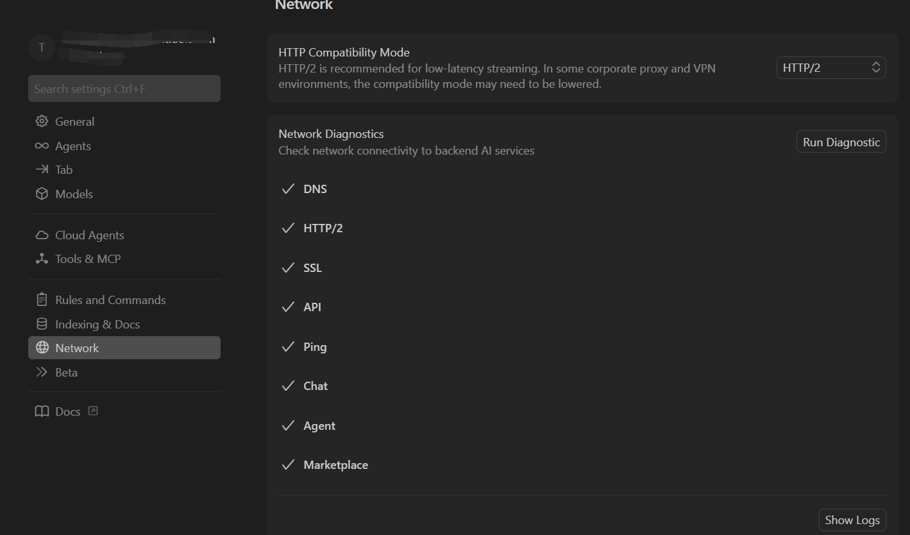

<h1 align="center">Cursor-Proxy</h1>

<p align="center">
  <b>🚀 专为 Cursor 编辑器打造：无需 TUN 模式，让 Cursor 稳定走代理</b>
</p>

<p align="center">
  
  
</p>

---

> 本项目基于 [antigravity-proxy](https://github.com/yuaotian/antigravity-proxy) 修改，专门适配 Cursor 编辑器。
> 遇到问题或需要高级配置，请参考 [antigravity-proxy 的 README](https://github.com/yuaotian/antigravity-proxy)。

## 💡 解决什么问题？

Cursor **不走系统代理**，导致在国内使用时经常出现：

- ❌ 模型断流、卡死、无响应
- ❌ 频繁要求手动重试
- ❌ 调用耗时较长的 MCP 工具时连接超时

**Cursor-Proxy 通过 DLL 注入方式，强制 Cursor 的网络流量走你的 SOCKS5/HTTP 代理，彻底解决这些问题。**

**同时，让我们在中国大陆也可以开启HTTP/2！享受更加先进的网络协议！**

## 🚀 快速开始

### Step 1：准备代理

确保你的代理软件已启动，且有可用的本地代理端口。

以 **Clash Verge** 为例，获取代理端口的方法如下：

1. 打开 Clash Verge 界面，点击左侧 **"设置"**
2. 找到 **"系统代理"** 区域，点击右侧齿轮图标打开详情
3. 查看 **服务地址** 中的端口号（如下图红色箭头所示）

<p align="center">
  
</p>

> **💡 提示：** Clash Verge 的默认端口通常为 `7890`，Clash Verge Rev 通常为 `7897`。请以你软件中实际显示的端口为准。将该端口填入 `config.json` 中即可。

### Step 2：下载文件

从 [Release](../../releases) 页面下载压缩包（默认 x64 版本），解压得到：

- `version.dll` — 代理注入模块
- `config.json` — 代理配置文件

> 也可以自行编译（见下方 [编译构建](#-编译构建)）。

### Step 3：放到 Cursor 目录

将 `version.dll` 和 `config.json` 复制到 **`Cursor.exe` 同级目录**：

```
C:\Users\<用户名>\AppData\Local\Programs\cursor\
├── Cursor.exe
├── version.dll      ← 放这里
└── config.json      ← 放这里
```

**快速跳转到 Cursor 目录：**

```powershell
cd "$env:LOCALAPPDATA\Programs\cursor"
```

### Step 4：启动 Cursor

直接启动 Cursor 即可。DLL 会自动加载并将网络流量转发至代理。

### Step 5（推荐）：开启 HTTP/2

在 Cursor 设置中（**Settings → Network**），将 HTTP Compatibility Mode 切换为 **HTTP/2**。

HTTP/2 支持**单连接多路复用**，多个请求可以在同一条连接上并发传输、互不阻塞，实际体验上：

- ✅ 多窗口/多标签页可同时进行补全、Chat、Agent 等操作，互不干扰
- ✅ 流式输出更流畅，断流概率大幅降低
- ✅ 头部压缩减少冗余数据，整体延迟更低

## ⚠️ 注意事项

- 记得关闭杀毒软件或将 `version.dll` 加入白名单
- 如遇 `0xc0000142` 错误，请安装 [VC++ 运行库](https://aka.ms/vs/17/release/vc_redist.x64.exe)
- Cursor 更新后可能需要重新放置文件

## ✅ 验证是否生效

启动 Cursor 后，打开 **Settings → Network**，点击 **Run Diagnostic** 按钮。如果所有检测项（DNS、HTTP/2、SSL、API、Ping、Chat、Agent、Marketplace）全部显示 ✅，说明代理已正常工作：

<p align="center">
  
</p>

你也可以通过以下方式进一步确认：

1. Cursor 目录下 `logs/` 文件夹是否生成了 `proxy-YYYYMMDD.log` 日志
2. 代理软件的连接日志中是否出现来自 Cursor 的请求

## 🔨 编译构建

需要安装 **Visual Studio 2022**（含 C++ 桌面开发）和 **CMake**。

```powershell
# 默认 Release x64 编译
.\build.ps1

# 编译 Debug 版本
.\build.ps1 -Config Debug

# 编译 32 位版本
.\build.ps1 -Arch x86
```

编译产物在 `output/` 目录。

## 🙏 致谢

- [antigravity-proxy](https://github.com/yuaotian/antigravity-proxy) — 本项目的基础，原作者：煎饼果子（86）
- [MinHook](https://github.com/TsudaKageworku/minhook) — API Hook 框架
